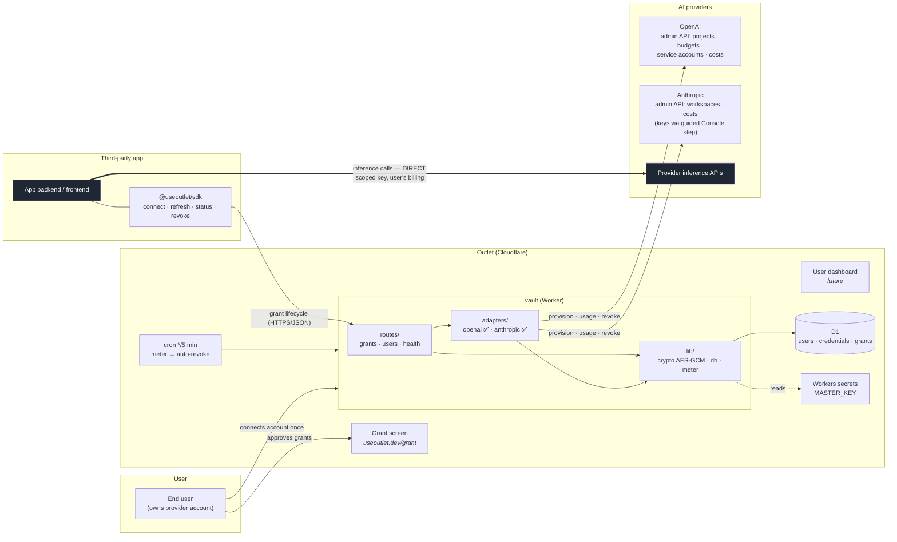
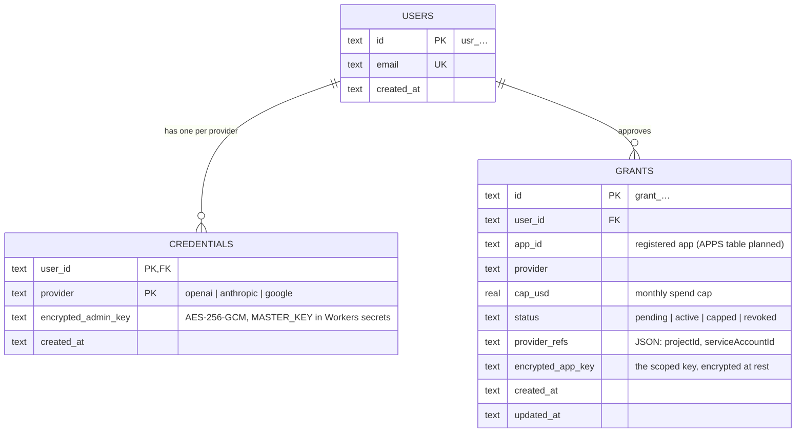
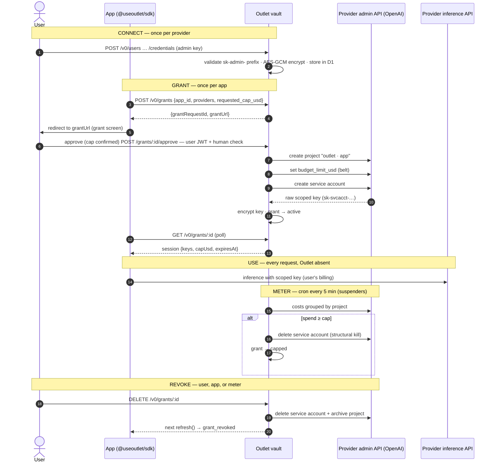

# Outlet — Architecture

Three views: system overview, data model, and the grant (OAuth-style) flow.
All three describe the code as it exists in `vault/` + `sdk/` today; future
pieces are marked. Protocol detail lives in [spec/SPEC.md](../spec/SPEC.md).

## 1. System overview

The defining property: **Outlet provisions and meters; it is never in the
data path.** Apps call providers directly.

The thick edge is the data path. It never touches Outlet.

## 2. Data model

Current schema (`vault/schema.sql`). One grant = one app × one provider ×
one user, with its own capped key.

Planned next (not yet in schema): `APPS` (registered developer apps with
verified identity for the grant screen) and `AUDIT_LOG` (user-visible record
of every provision/refresh/revoke — SPEC §6).

## 3. Grant flow (OAuth-style)

OAuth-shaped: the app never sees the user's root credential; it receives a
scoped, capped, revocable key after explicit user consent.

Known prototype gaps (by design, tracked): crypto deviation from SPEC §6
is blessed in [ADR 0001](adr/0001-credential-encryption.md). The approve
step is no longer among them — it requires a verified user session
(ADR 0003) and, where a Turnstile secret is bound, a passed human check.
